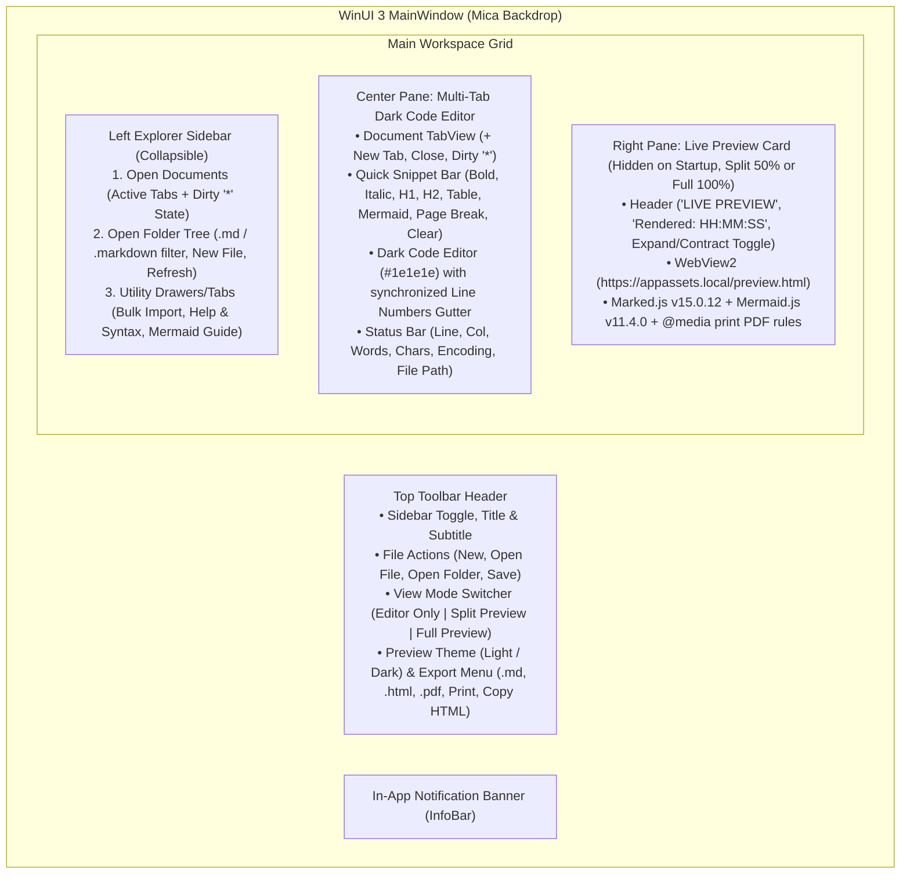

# Implementation Plan: MarkdownPro Editor & Previewer (WinUI 3)

## 1. Architecture & User Experience Overview

`MarkdownPro` is a native **WinUI 3** desktop application built using **Option A** (Native WinUI 3 Shell + Native Multi-Tab Dark Code Editor + `WebView2` Offline Preview Engine) with 100% local offline processing.

### Key UX Decisions Confirmed
1. **Startup Layout**: Opens in **Editor-Only Mode** (full workspace width for the active editor tab, with the collapsible Left Explorer Sidebar).
2. **Top-Right View Mode Buttons**:
   - **Editor Only**: Hides the preview pane so the editor occupies 100% of the main workspace.
   - **Split Preview**: Displays the Editor (50%) and Live Preview (50%) side by side with a draggable grid splitter.
   - **Full Preview**: Expands the Live Preview to 100% of the workspace (matching the focus view mode), with a contract button to return to Editor/Split mode.
3. **Left Explorer Sidebar**:
   - **Open Documents**: Lists all open document tabs with dirty `*` indicators, quick switching, and close buttons.
   - **Open Folder**: Displays a hierarchical directory `TreeView` filtered to folders and Markdown files (`.md`, `.markdown`, `.mdown`), with quick buttons for **Open Folder**, **New File in Folder**, and **Refresh**.
   - **Session Persistence**: Saves and restores the last opened folder path, open file tabs, preview theme, and view mode in `%LOCALAPPDATA%\MarkdownPro\session.json`.
4. **Default `.md` Application & Single-Instance File Activation**:
   - Registers `.md`, `.markdown`, `.mdown`, and `.mkd` file associations in `Package.appxmanifest` and per-user registry classes (`HKCU\Software\Classes`).
   - Uses `Microsoft.Windows.AppLifecycle.AppInstance` single-instance redirection so double-clicking any `.md` file in Windows Explorer opens it as a new tab in the existing `MarkdownPro` window.
   - Prompts on launch (with a *"Don't ask again"* checkbox and a toolbar button to invoke anytime) to set `MarkdownPro` as the default `.md` application.

---

## 2. Project Dependencies & Bundled Offline Assets

### 2.1 Project File Updates
* **`MarkdownPro.csproj`**:
  * Add `CommunityToolkit.Mvvm` (`8.4.0`) for `ObservableObject` and `RelayCommand`.
  * Include `Assets\Web\**\*` as `<Content CopyToOutputDirectory="PreserveNewest" />`.

### 2.2 Offline Web Assets (`Assets/Web/`)
Mapped to `https://appassets.local/` via `CoreWebView2.SetVirtualHostNameToFolderMapping`:
* `Assets/Web/marked.min.js` — `v15.0.12` Markdown-to-HTML parser.
* `Assets/Web/mermaid.min.js` — `v11.4.0` Diagram-to-SVG compiler.
* `Assets/Web/preview.html` — Offline HTML host page implementing:
  * GitHub Light (`#ffffff` / `#24292e`) and Dark (`.dark-preview` `#0d1117` / `#c9d1d9`) CSS rules.
  * `@media print` pagination, orphan/widow control, SVG sizing, table header repetition, and explicit `

` rules.
  * Three-stage `renderMarkdown(rawText)` pipeline:
    1. `marked.parse(rawText)`
    2. Mermaid block extraction (`pre code.language-mermaid, code.language-mermaid`) and Unicode arrow normalization (`→`, `—>`, `–>` $\rightarrow$ `-->`).
    3. Isolated per-node `await mermaid.run({ nodes: [node] })` execution with per-diagram red dashed error boxes (`border: 1px dashed #dc3545; background: #fff5f5; color: #dc3545;`) on syntax errors.
  * Posts `{ type: 'rendered', timestamp: 'HH:MM:SS', html: output.innerHTML }` back to WinUI 3 via `window.chrome.webview.postMessage`.

---

## 3. Planned Files & Component Breakdown

### 3.1 Models & Services (`Models/` & `Services/`)
1. `Models/MarkdownDocument.cs`:
   * Represents an open document tab (`Id`, `Title`, `FilePath`, `Content`, `SavedContent`, `IsDirty`, `DisplayTitle` with `*` when modified).
   * Provides the default `# Welcome to Markdown Pro` starter template when creating the initial untitled workspace.
2. `Models/FolderNode.cs`:
   * Represents a directory or `.md` file item in the Explorer sidebar `TreeView` (`Name`, `FullPath`, `IsDirectory`, `Children`).
3. `Models/BulkFileItem.cs`:
   * Represents a queued `.md` file in the Bulk Update tool (`Index`, `FileName`, `FullPath`, `FileSizeKb`, `CanMoveUp`, `CanMoveDown`).
4. `Services/SessionService.cs`:
   * Loads and saves `SessionState` (`LastFolderPath`, `OpenFilePaths`, `ActiveFilePath`, `PreviewTheme`, `ViewMode`, `SuppressDefaultAppPrompt`) to `%LOCALAPPDATA%\MarkdownPro\session.json`.
5. `Services/FileAssociationService.cs`:
   * Checks whether `MarkdownPro` is registered as the handler for `.md` files in `HKCU\Software\Classes`.
   * Registers the per-user ProgId (`MarkdownPro.Document`) and `OpenWithProgids` for `.md`, `.markdown`, `.mdown`, `.mkd` pointing to the executable, and opens Windows Default Apps settings (`ms-settings:defaultapps`) when requested.

### 3.2 App Lifecycle & Single-Instance Activation
1. **`App.xaml.cs`** & **`Package.appxmanifest`**:
   * Configure single-instance registration (`AppInstance.FindOrRegisterForKey("MarkdownPro.MainInstance")`).
   * If a secondary instance is launched (e.g., double-clicking a `.md` file in File Explorer), redirect activation arguments to the primary instance and bring the main window to the foreground.
   * Declare `<uap:FileTypeAssociation Name="markdown">` for `.md`, `.markdown`, `.mdown`, and `.mkd` in `Package.appxmanifest`.

### 3.3 Main Window UI & Workspace Controls
1. **`MainWindow.xaml`** & **`MainWindow.xaml.cs`**:
   * **Top Toolbar Header**:
     * Left: Sidebar toggle button, Markdown icon, title (`Markdown Pro`), subtitle, and file actions (`New`, `Open File`, `Open Folder`, `Save`, `Set Default .md App`).
     * Right:
       * **Workspace View Switcher**: `Editor` | `Bulk Update` | `Help & Syntax` | `Mermaid Guide`.
       * **Preview Layout Buttons**: `Editor Only` (default on startup), `Split Preview`, `Full Preview`.
       * **Preview Theme `ComboBox`**: `Light Preview` (`light`), `Dark Preview` (`dark`).
       * **Export `DropDownButton`**:
         * `Markdown (.md)` via `FileSavePicker`
         * `HTML Document (.html)` via `FileSavePicker` (standalone styled HTML)
         * `Export PDF (.pdf)` via `FileSavePicker` + `CoreWebView2.PrintToPdfAsync`
         * `Print... (Ctrl+P)` via `CoreWebView2.ShowPrintUI`
         * `Copy Rendered HTML` to clipboard
   * **Left Explorer Sidebar**:
     * **Open Documents list**: Shows open tabs with dirty indicators and close buttons.
     * **Open Folder tree**: Shows hierarchical folder and `.md` file nodes, plus `Open Folder`, `New File`, and `Refresh` toolbar icons.
   * **Center Workspace (4 Switchable Views)**:
     * **View 1 — Multi-Tab Dark Editor**:
       * `TabView` bound to open `MarkdownDocument` items.
       * Dark `#1e1e1e` header bar with quick snippet buttons (`Bold`, `Italic`, `Table`, `Mermaid`, `Page Break`, `Clear`).
       * Synchronized line-number gutter + `#1e1e1e` monospace `TextBox` (`Cascadia Mono, JetBrains Mono, Consolas`, `AcceptsReturn="True"`, Tab-key indentation, `Ctrl+B`/`Ctrl+I`/`Ctrl+S`/`Ctrl+O`/`Ctrl+P` shortcuts, 300ms debounced preview update).
       * Bottom status bar displaying `Ln X, Col Y`, word/character count, and file path.
     * **View 2 — Bulk Update (`BULK IMPORT (.md)`)**:
       * Add `.md` files via `FileOpenPicker.PickMultipleFilesAsync()` (enforcing the 20-file maximum with warning alert).
       * Queue list with index badge, filename, KB size badge, Move Up (`↑`), Move Down (`↓`), Remove (`✕`), and `Clear All`.
       * `Extract & Append Files` button implementing the exact smart overwrite/append logic with `

` and `<!-- BEGIN FILE: ... -->`, switching back to the Editor view and displaying an `InfoBar` toast notification.
     * **View 3 — Help & Syntax**:
       * Editor overview, clickable `

` copy box, and Standard Markdown Syntax reference table.
     * **View 4 — Mermaid Guide (`MERMAID v11.4.0`)**:
       * Clickable 9-row Node Shapes table, Node Styling examples, and Flowchart / Sequence Diagram / Entity Relationship copyable templates.
   * **Right Preview Pane (`WebView2`)**:
     * Hidden on startup (Editor-Only mode), shown at 50% width in Split Preview mode or 100% width in Full Preview mode.
     * Header bar with `LIVE PREVIEW`, `Rendered: HH:MM:SS` timestamp, and Expand/Contract Focus View toggle button.

---

## 4. Verification Plan
1. Copy `marked.min.js` and `mermaid.min.js` into `Assets/Web/` and verify asset bundling.
2. Build both `MarkdownPro.csproj` and `MarkdownPro (Package).wapproj` using `dotnet build` and Visual Studio `MSBuild.exe` to ensure 0 errors and 0 warnings.
3. Verify startup state (Editor-Only view, starter template, default `.md` app prompt), Split/Full preview rendering, Bulk Update merging, Mermaid error isolation, and PDF/HTML/Markdown exports.

