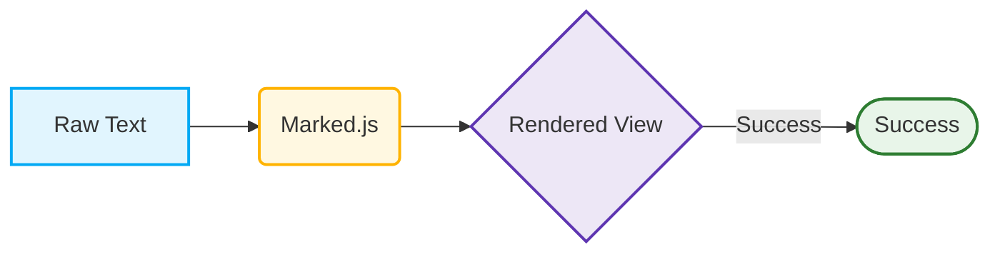

# Welcome to Markdown Pro

Built-in support for **Markdown** and **Mermaid** diagrams.

## 1. Example Mermaid Diagram

## 2. Dynamic Tables


| Feature | Supported |
| :--- | :--- |
| Real-time | Yes |
| Export | Yes |
| Privacy | 100% |

## 3. Code Snippets

```sql
SELECT *
FROM dbo.CustomerDetails
WHERE Name Like 'Test'
ORDER BY ID DESC

```

```C#
using System;

namespace ClassExample
{
    // Defining the class
    public class Car
    {
        // Properties (Attributes)
        public string Brand { get; set; }
        public string Model { get; set; }
        public int Year { get; set; }

        // The Constructor method (runs automatically when an object is created)
        public Car(string brand, string model, int year)
        {
            Brand = brand;
            Model = model;
            Year = year;
        }

        // A method to display information
        public string DisplayInfo()
        {
            return $"{Year} {Brand} {Model}";
        }

        // A method representing an action
        public string StartEngine()
        {
            return $"The engine of the {Model} is now running.";
        }
    }
}
```


> Click **File > Export** to download this file as a PDF or Markdown document..
